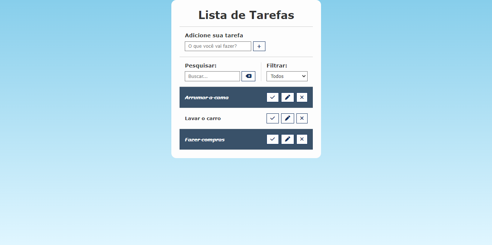

# TO-DO-LIST
Simples programa em Javascript que organiza tarefas a serem realizadas

## O projeto

  

## Resumo
Este projeto tem como objetivo a criação de uma lista de tarefas simpes do quel seja possível gerenciar tarefas de forma pratica.

Futuramente serão adicionados:

| Recurso | Prioridade |
| ------ | ------ |
| Sistema de pesquisa| 1 |
| Sistema de filtro | 1 |
| Salvar tarefas via json | 2 |
| Consumir o arquivo json | 2 |

## Como rodar

### No Visual Studio Code ou via Browser
Realize o download do projeto e execute a pagina index.html

## Dependencias
Este projeto não possui dependências.

## Esta aplicação utiliza: 
JAVASCRIPT, HTML5, CSS3 e GIT
